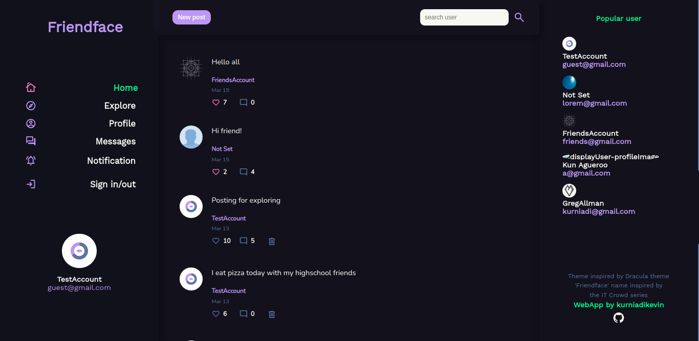

# Friendface

This social facebook style app is develop using MERN Stack. Using express backend API that you can check on 
[friendface-api](https://github.com/kurniadikevin/friendface-api). This app let using share post with text and image and interact with the post by likes it or comment it.

The latest update is added messager feature for user to chat with each other in a private two person format or in group chat format.

This repository is contain Front-End code only. Develop using React js and vanilla css and using axios for api request.
You can forked this repository install all dependency with terminal command
```
npm install
```

And run it using.

```
npm start
```
After you have node package manager installed.

This project is just for fun project and learning purpose. Feel free to using the app or modify it to your liking. Thank you!


