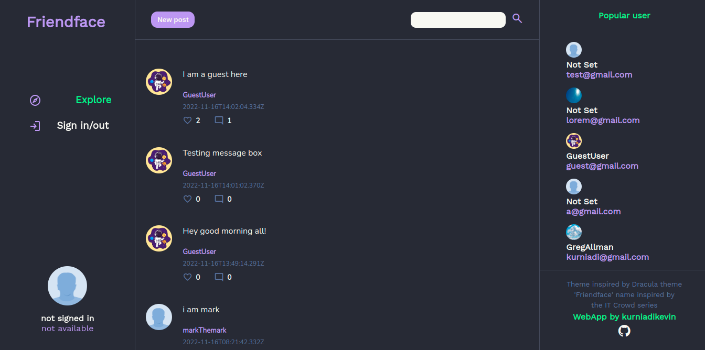

# Friendface

This social facebook style app is develop using MERN Stack. Using very simple backend API that you can check it on 
[odin-book-api](https://github.com/kurniadikevin/odin-book-api).

This repository is contain Front-End code only. Develop using React js and standard css.

You can forked this repository and run it using.
```
npm start
```
After you have node package manager installed.

This project is just for fun project and learning purpose. Feel free to using the app or modify it to your desire. Thank you!



